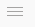
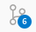
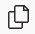

## Editar o Site

✅ Clique no link a seguir para editar o [Site do GEPDAI](https://gitlab.com/unesp-labri/sites/labri/-/tree/main/website/src/pages/gepdai)

✅ No canto superior direito da tela clique em `Edit` e escolha `Gitpod`. Será pelo Gitpod` que a edição será feita.

✅ Na parte inferior terá um item chamado `TERMINAL` e uma linha colorida com a seguinte informação: `gitpod /workspace/labri (main) $`. Nesta linha digite a frase abaixo (você pode copiar e copiar ela também) e aperte `enter`:

```sh

bash editar_site.sh

```

✅ Pronto você esta no mode de edição do site 🎉!!

## Abrir as pastas para edição

⚫ Basicamente, são duas pastas gerais para editar as informações do site: Uma é a que estãoas as imagens (`/workspace/labri/website/static/img/gepdai`) e a outro em que as demais paginas do site a `/workspace/labri/website/src/pages/gepdai` .

⚫ Para abrir diretamente a pasta das imagens do GEPDAI clique em  (localizado no canto superior direito),em seguida clique em `File` e depois em `Open Folder...`
e coloque o seguinte caminho: `/workspace/labri/website/src/pages/gepdai`

⚫ Para abrir diretamente a pasta das imagens do GEPDAI clique em  (localizado no canto superior direito),em seguida clique em `File` e depois em `Open Folder...`
e coloque o seguinte caminho: `/workspace/labri/website/static/img/gepdai`

⚫ Depois de fazer o item assima uma primeira vez, é possivel acessar a pasta da seguinte maneira: clique em  (localizado no canto superior direito),em seguida clique em `File` e depois em `Open Recent`
e escolher a pasta.

## Salvar a Edição

✅ No canto esquerdo do `Gitpod` deve aparecer um simbolo como esse  (o número pode estar diferente. Ele indica a quantidade de arquivos modificados que ainda não foram salvos)

✅ Na caixinha escrito `Message`escreve uma breve indicação do que foi editado e clique no botão `Commit`.

✅ Pronto você Salvou a edição realizada. Em torno de 10 minutos, as modificações estarão públicas na internet 🎉!!

## Estrutura do site

```
📂 website
 ├── 📂 src
     ├── 📂 pages
         ├── 📂 gepdai
             ├── 📂 sobre
             │   ├── 📄 index.js
             │   ├── 📄 styles.sobre.module.css
             ├── 📂 publicacoes
             │    ├── 📄 index.js
             │   ├── 📄 styles.publicacoes.module.css
             ├── 📂 equipe
             │    ├── 📄 index.js
             │    ├── 📄 styles.equipe.module.css
             ├── 📄 index.js
             ├── 📄 geral.js
             ├── 📄 styles.global.module.css
             ├── 📄 styles.home.module.css

```

⚫ Na lateral direita do `Gitpod` com esse icone  selecionado é possivel ver toda a estrutura de pastas e arquivos do site. Dentro da pasta `website/src/pages/gepdai` estão arquivos do site do GEPDAI.

⚫ Nos arquivos com a extensão `.js` ficam a estrutura da página e os dados que são exibidos. Nos arquivos com a extensão `.css` ficam as informações de estilo (cores, fotes, tamnhos, posições entre outras).

## Edição do Menu e Capa

⚫ Além do Menu e capa será os arquivos indicados abaixo que é possivel ajustar os estilos de fontes, titulos e paragrafos.

⚫ Na lateral direita do `Gitpod` navegue até a página do GEPDAI `website/src/pages/gepdai` e clique o arquivo `geral.js`. Para ajustar o estilos edite o arquivo `styles.global.module.css`.

## Edição da `Home`

⚫ Na lateral direita do `Gitpod` navegue até a página do GEPDAI `website/src/pages/gepdai` e clique o arquivo `index.js`. Para ajustar o estilos edite o arquivo `styles.home.module.css`.

Procure a `const faixa_01` (pode dar um ``ctrl + f`) ou `const faixa_02`. Cada bloco que esta entre as chaves `{}` contem as informações que constam em uma das faixas.

⚫ Você pode ajustar a ordem das publicações que apareceram na web ou acrescentar um bloco com os dados de uma nova publicação. Veja o exemplo abaixo da `faixa_02`:

```
    {
    projeto: "gepdai - labri-unesp",
    titulo: "Conheça nossa equipe",
    path_imgFoto: "/img/gepdai/equipe.svg",
    link: "/gepdai/equipe",
    texto: (
      <>
        Nossa equipe é formada por professores, estudantes de graduação, pós-graduação, graduados.
      </>
    )
  },

```

## Edição de `Publicações`

⚫ Na lateral direita do `Gitpod` navegue até a página do GEPDAI `website/src/pages/gepdai` e clique o arquivo `index.js` que está dentra da pasta `publicações`. Para ajustar o estilos edite o arquivo `styles.publicacoes.module.css`.

⚫ Procure a `const publicacoes` (pode dar um ``ctrl + f`). Cada bloco que esta entre as chaves `{}` contem as informações de uma publicação.

⚫ Você pode ajustar a ordem das publicações que apareceram na web ou acrescentar um bloco com os dados de uma nova publicação. Veja o exemplo abaixo:

```
    {
        projeto: "publicacoes - labri-unesp",
        titulo: "INSIRA O TITULO AQUI",
        autoria: "Autora: INSIRA OS AUTORES AQUI",
        path_imgIcon: "/img/cidades-sustentaveis/pdf-icon.svg",
        link: "http://dx.doi.org/10.38116/rtm32art5"
    },

```

### Edição de `Equipe`

⚫ Na lateral direita do `Gitpod` navegue até a página do GEPDAI `website/src/pages/gepdai` e clique o arquivo `index.js` que está dentra da pasta `equipe`. Para ajustar o estilos edite o arquivo `styles.equipe.module.css`.

⚫ Procure a `const membrosAtuais` (pode dar um ``ctrl + f`). Cada bloco que esta entre as chaves `{}` contem as informações de um membro do grupo.

⚫ Você pode ajustar a ordem dos membros que apareceram na web ou acrescentar um bloco com os dados de uma nova publicação. Veja o exemplo abaixo:

```
{
    projeto: "gepdai - labri-unesp",
    nome: "INSIRA AQUI O NOME DO MEMBRO DA EQUIPE",
    linkRedeSocial: "INSIRA AQUI O LINK DO LATTES",
    linkRedeSocial2: ""INSIRA AQUI O LINK DO LINKEDIN",
    descricao: "INSIRA A DESCRIÇÃO AQUI",
    path_imgLogoRedeSocial: "/imagens/logos/lattes.png",
    path_imgFoto: "/img/gepdai/icon2.png",
    path_imgLogoRedeSocial2: "/imagens/logos/linkedin.svg"

    },


```

### Edição da Página `Sobre`

⚫ Na lateral direita do `Gitpod` navegue até a página do GEPDAI `website/src/pages/gepdai` e clique o arquivo `index.js` que está dentro da pasta `sobre`. Para ajustar o estilos edite o arquivo `styles.sobre.module.css`.

⚫ Procure a `const conhecer` e a `const atividades`. Cada bloco que esta entre as chaves `{}` contem as informações de um membro do grupo.

⚫ Você pode ajustar a ordem dos membros que apareceram na web ou acrescentar um bloco com os dados de uma nova publicação. Veja o exemplo abaixo dos blocos da `const atividades`:

```
{
    projeto: "gepdai - labri-unesp",
    titulo: "INSIRA AQUI O TITULO D ATIVIDADE",
    texto: (
      <>
      INSIRA AQUI O TITULO D ATIVIDADE UM TEXTO OU DESCRIÇÃO DA ATIVIDADE
      </>
    ),
    path_imgSobre: "/img/gepdai/sobre-pag2.svg",
  },

```

## Inserir fotos e imagens

⚫ Para inserir fotos dos membros faça upload na [esta página](https://gitlab.com/unesp-labri/sites/labri/-/tree/main/website/static/img/gepdai) `website/static/img/gepdai`

⚫ Coloque o caminho da imagem inserida (será `/img/gepdai/NOME_DO_ARQUIVO_UPLOAD.extensao`) na pasta acima no local desejado no arquivo com extensão `.js`.

⚫ Troque o `NOME_DO_ARQUIVO_UPLOAD.extensao` insicado acima pelo nome do arquivo de sua imagem (por exemplo, `mundo.png`)

```

```
